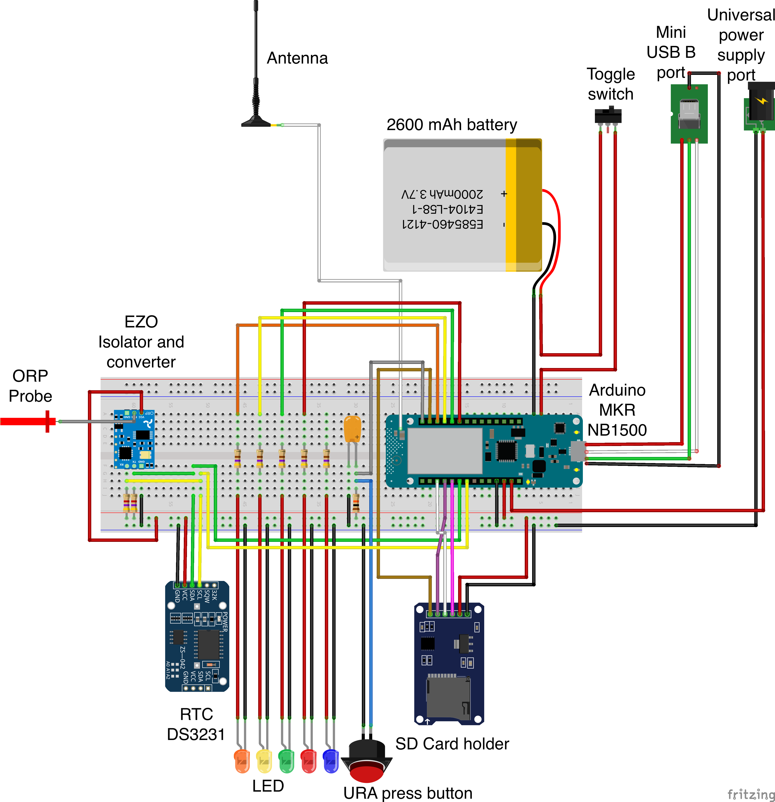
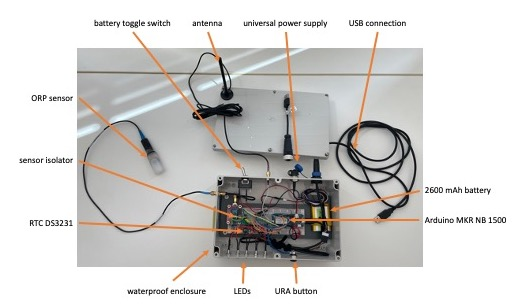

- [General description of project](#general-description-of-project)
- [User guide](#user-guide)
  - [Development environment](#development-environment)
  - [`rel` branch structure](#rel-branch-structure)
    - [final_project](#final_project)
    - [misc](#misc)
  - [QuickStart guide](#sec-quickstartGuide)
    - [Configuration settings](#configuration-settings)
    - [LED error signal description](#led-error-signal-description)
- [Component selection](#sec-componentSelection)
- [Improvements](#improvements)
  - [codebase](#codebase)
    - [Wake up from deepsleep, from low
      battery](#wake-up-from-deepsleep-from-low-battery)
    - [Storage optimisation](#storage-optimisation)
    - [Adding new sensors to the predicting
      algorithm](#adding-new-sensors-to-the-predicting-algorithm)
    - [Tuning the RMS ID](#tuning-the-rms-id)
- [References](#references)

# General description of project

<!-- badges: start -->

<!-- badges: end -->

This project is a remote monitoring system developed for the Water Wall
of the [Blue Diversion Autarky
Project](https://www.eawag.ch/en/research/humanwelfare/wastewater/projects/autarky/),
developed at EAWAG.

Insufficiently treated reused water can transmit
diseases\[1\]. It is necessary to ensure that the treated
water is microbially safe at all times\[2\]. To monitor the
microbial water quality in the clean water tank, to ensure sufficently
high microbial water quality, currently, the operator must perform
biweekly, onsite water sampling\[3\]. This is time-consuming,
cost-inefficient and limits the possibility of performing high-quality
field tests.

This RMS (Remote Monitoring System) project aims to tackle this
challenge by providing a real-time, online microbial water quality
prediction system. This RMS communicates problems to operators (in order
to fix the problem) as well as to users (to make sure they are made
aware in case the water is unsafe).

This RMS is an implementation of the machine learning model developed at
EAWAG\[4\]. Currently, the only input parameter is the ORP
reading. Decision making of water being safe or unsafe is based on a
cut-off value found from the trained model. In practice, this value may
be set by the operator, according to their needs.

If you need guidance or assistance, please feel free to contact me at
cedricormond@gmail.com.

# User guide

<!--- The project is divided in 3 folders 
- final project
- RTC calibration
- ML model --->

If you are using the project directly from the github, please make sure
you do not push any modifications, and only use the release (rel) branch
for using the RMS.

## Development environment

This project was developped using
[VSCode](https://code.visualstudio.com/download) and the
[platformIO](https://platformio.org/install/ide?install=vscode)
extension.

## `rel` branch structure

This branch is organised in 2 folders:

- final_project
- misc

### final_project

This folder contains the source code for the project. If you want to
build and upload the platformIO project to your prototype, you will need
to navigate your way to this branch and follow the instructions provided
in [Section 2.3](#sec-quickstartGuide).

### misc

This folder contains aditional files useful for the project.

## QuickStart guide

This section details the step to take to start using the device.

To use the RMS:

1.  clone this [repo](https://github.com/cedricormond00/RMS), and make
    sure you are on the `rel` branch (`git checkout rel`). You may
    alternatively download the .zip file from the DOI link provided at
    the top (recommended)
2.  in the terminal, navigate your way to the final_project folder
    (`cd yourPath/RMS/final_project`)
3.  in the terminal, type `code .`. (You will need to have installed and
    downloaded [VSCode](https://code.visualstudio.com/download)
    beforehand. Make sure you have the
    [platformIO](https://platformio.org/install/ide?install=vscode) IDE
    added to your VSCode)
4.  assemble the hardware from [Section 3](#sec-componentSelection) as
    shown in figure [Figure 1](#fig-assembly)
5.  configure settings as described in section
    [Section 2.3.1.1](#sec-configDescription)
6.  build the project in VSCode
7.  upload the platformIO project to the board. Once uploaded, the
    device will automatically start

<figcaption>
Figure 1: RMS assembly diagram.
</figcaption>

<figcaption>
Figure 2: RMS assembly diagram.
</figcaption>

### Configuration settings

If the device is used for the first time, make sure the device is
connected to a PC. This will help debugging potential wrong settings.

The first automatic run will create a RMS_V1.CFG file, with default,
hard-coded settings. Once the device has run at least once, you can
safely disconnect all power supply, remove the SD card, and easily tune
the configuration settings.

Alternatively, you can easily upload the RMS_V1.CFG file to the SD card
before the first run. RMS_V1.CFG can be found in the “misc” folder.

#### Configuration settings description

The parameters that may be tuned during the configuration are the
following.

*logitThreshold* : (mv) any ORP reading above this value will translate
into a safe waterquality. The appropriate setting may be found from
running the code in\[4\].

*uraPressDuration* : (ms) how long the user should press the button for
an alarm to be raised. In case an SMS has already been sent less then
*uraSMSInterval*, only a water monitoring will occur, but no SMS will be
spamming the user.

*hbTargetHour* : (hour, 24) at what time should a heartbeat be sent to
the operator.

*hbIntervalHour* : (hour) at what frequency should the heartbeat be
sent, starting from the *hbTargetHour*. Ensure this value is less or
equal to 24. For example, consider *hbTargetHour* = 9 and
*hbIntervalHour* = 6. A heartbeat will be sent to the operator at 9:00,
15:00, 21:00, 03:00. Please note that the exact time at which a
heartbeat is sent is the closest time to the aforementioned full hour,
plus a maximum of *s/u/fwqSleepPeriod*. Indeed the heartbeat SMS is sent
after the device woke up for a watermonitoring function.

*swqSleepPeriod* : (s) how much time should elapse between two water
monitoring events, from the water quality being safe.

*uwqSleepPeriod* : (s) how much time should elapse between two water
monitoring events, from the water quality being unsafe.

*fwqSleepPeriod* : (s) how much time should elapse between two water
monitoring events, from having received a faulty ORP reading.

*uraSMSInterval* : (s) how much time should elapse, before a new SMS can
be sent to the operator, informing them that the user raised an alarm.
This is to prevent spamming the operator with notifications in case the
user uses too often the button press.

*wmSMSInterval* : (s) how much time should elapse, before a new SMS can
be sent to the operator, updating them on the waterquality status, after
an unsafe or faulty reading was first detected. This is to prevent
spamming the operator with notification in the case of unsafe water
quality or faulty reading.

*sendSMS* : (boolean) sets whether the SMS should be sent to the
operator or not.

*remoteNumberLength* : (integer) holds the length of the operator phone
number.

*remoteNumber* : (string) holds the operator phone number. Make sure to
include the country code: for example “0041798837769” for a Swiss
number.

### LED error signal description

When the RMS is started, in case of problems during initialisations,
LEDs provide some feedback.

One or two LEDs are on, to indicate what region is affected, while
another LED will blink to differentiate between the possible causes for
the issue. The table below provides a guide to debug potential problems.

| Region  | Exact problem                                        | On LED         | Blinking LED |
|---------|------------------------------------------------------|----------------|--------------|
| Battery | Battery not conected                                 | Orange         | Red          |
| Battery | Low battery energy level                             | Orange         | Yellow       |
| SD Card | Failed to initialise                                 | Green          | Red          |
| SD Card | Failed to create a valid filename                    | Green          | Yellow       |
| SMS     | Inappropriate phone number                           | Yellow         | Red          |
| RTC     | Failed to initialise internal RTC using external RTC | Green + orange | Red          |
| RTC     | Failed to set-up heartbeat                           | Green + orange | Yellow       |
| Unknow  | Unknown error                                        | Red            | Blue         |

# Component selection

The following components were used for the prototype. For ease of
reproducibility, links to the used suppliers are provided. The final
cost of the hardware amounts to just under CHF 390, including the
sensor.

| **Category**        | **Item description**                          | **Comment**                             | **Brand**        | **Quantity** | **Unitary cost** | **Total cost** | **Supplier link**                                                                                                                                                                                                                                                                                                        | **manufacturer link**                                            | **Manufacturer code** |
|---------------------|-----------------------------------------------|-----------------------------------------|------------------|--------------|------------------|----------------|--------------------------------------------------------------------------------------------------------------------------------------------------------------------------------------------------------------------------------------------------------------------------------------------------------------------------|------------------------------------------------------------------|-----------------------|
| Arduino Board       | MKR NB 1500                                   |                                         | Arduino          | 1            | CHF 71.39        | CHF 71.39      | https://www.distrelec.ch/fr/arduino-mkr-nb-1500-arduino-abx00019/p/30117099?track=true&no-cache=true&marketingPopup=false                                                                                                                                                                                                | https://store.arduino.cc/products/arduino-mkr-nb-1500            |                       |
| UI                  | Orange LED                                    |                                         | RND Components   | 1            | CHF 1.75         | CHF 1.75       | https://www.distrelec.ch/en/led-indicator-pcb-pins-fixed-orange-dc-2v-rnd-components-rnd-210-00674/p/30176538?trackQuery=LED+Indicator%2c+PCB+Pins%2c+Fixed%2c+Orange%2c+DC%2c+2V%2c+RND+Components&pos=13&origPos=13&origPageSize=50&track=true                                                                         |                                                                  | RND 210-00674         |
| UI                  | Yellow LED                                    |                                         | RND Components   | 1            | CHF 1.95         | CHF 1.95       | https://www.distrelec.ch/en/led-indicator-pcb-pins-fixed-yellow-dc-2v-rnd-components-rnd-210-00675/p/30176539?trackQuery=210-00675&pos=1&origPos=1&origPageSize=50&track=true                                                                                                                                            |                                                                  | RND 210-00675         |
| UI                  | Green LED                                     |                                         | RND Components   | 1            | CHF 1.95         | CHF 1.95       | https://www.distrelec.ch/en/led-indicator-pcb-pins-fixed-green-dc-2v-rnd-components-rnd-210-00673/p/30176537?queryFromSuggest=true                                                                                                                                                                                       |                                                                  | RND 210-00673         |
| UI                  | Red LED                                       |                                         | RND Components   | 1            | CHF 1.95         | CHF 1.95       | https://www.distrelec.ch/en/led-indicator-pcb-pins-fixed-red-dc-2v-rnd-components-rnd-210-00672/p/30176536?queryFromSuggest=true                                                                                                                                                                                         |                                                                  | RND 210-00672         |
| UI                  | Blue LED                                      |                                         | RND Components   | 1            | CHF 1.98         | CHF 1.98       | https://www.distrelec.ch/en/led-indicator-pcb-pins-fixed-blue-dc-2v-rnd-components-rnd-210-00676/p/30176540?trackQuery=LED+Indicator%2c+PCB+Pins%2c+Fixed%2c+Blue%2c+DC%2c+2V%2c+RND+Components&pos=6&origPos=6&origPageSize=50&track=true                                                                               |                                                                  | RND 210-00676         |
| UI                  | User button press                             | User raised alarm button                | RND Components   | 1            | CHF 4.80         | CHF 4.80       | https://www.distrelec.ch/en/anti-vandal-push-button-switch-momentary-function-spst-panel-mount-black-red-rnd-components-rnd-210-00567/p/30134960?track=true&no-cache=true&marketingPopup=false                                                                                                                           |                                                                  | RND 210-00567         |
| SMS Communication   | Antenna                                       | Prototype uses a slightly different one | Arduino          | 1            | CHF 5.70         | CHF 5.70       | https://www.distrelec.ch/fr/antenne-gsm-2g-3g-4g-dbi-fl-support-adhesif-arduino-x000016/p/30101972?&cq_src=google_ads&cq_cmp=18318188127&cq_con=&cq_term=&cq_med=pla&cq_plac=&cq_net=x&cq_pos=&cq_plt=gp&gclid=Cj0KCQjwnrmlBhDHARIsADJ5b_mY_m0nUqeMlJN3qyH_5C25cz63-XVXhBc8LV99wYNgYx2_ZzH7XpMaAo-4EALw_wcB&gclsrc=aw.ds |                                                                  | X000016               |
| SMS Communication   | SIM card                                      | Function of country                     |                  | 1            | 2                | CHF 2.00       |                                                                                                                                                                                                                                                                                                                          |                                                                  |                       |
| Datalogging         | MKR MEM Shield                                |                                         | Arduino          | 1            | CHF 22.84        | CHF 22.84      | https://www.distrelec.ch/fr/shield-arduino-mkr-mem-arduino-asx00008/p/30117217?trackQuery=Arduino+MKR+MEM+Shield&pos=1&origPos=1&origPageSize=50&track=true                                                                                                                                                              | https://docs.arduino.cc/hardware/mkr-mem-shield                  |                       |
| Datalogging         | RTC DS3231                                    |                                         | Adafruit         | 1            | CHF 25.00        | CHF 25.00      | https://www.distrelec.ch/fr/rtc-de-precision-ds3231-adafruit-3013/p/30091211?trackQuery=DS3231&pos=1&origPos=1&origPageSize=50&track=true                                                                                                                                                                                | https://www.adafruit.com/product/3013                            |                       |
| Datalogging         | micro SD Card                                 |                                         | Kingston         | 1            | 5.6              | CHF 5.60       | https://www.distrelec.ch/en/memory-card-microsd-32gb-100mb-85mb-black-kingston-sdcs2-32gbsp/p/30201902?trackQuery=microSD+card&pos=18&origPos=18&origPageSize=50&track=true                                                                                                                                              |                                                                  | SDCS2/32GBSP          |
| Backup power supply | Toggle switch                                 | Battery kill switch                     | Bulgin           | 1            | CHF 6.02         | CHF 6.02       | https://www.distrelec.ch/en/toggle-switch-on-on-20-1co-ip67-bulgin-limited-c3910baaaa/p/30013174?track=true&no-cache=true&marketingPopup=false                                                                                                                                                                           |                                                                  | C3910BAAAA            |
| Backup power supply | battery                                       |                                         |                  | 1            | 25               | CHF 25.00      |                                                                                                                                                                                                                                                                                                                          |                                                                  |                       |
| Power supply        | Micro USB B to 5 pin header                   | Handcrafted                             | NA               | 1            | CHF 2.00         | CHF 2.00       |                                                                                                                                                                                                                                                                                                                          |                                                                  |                       |
| Power supply        | Mini USB B Bucaneer                           |                                         | Bulgin           | 1            | 11.97            | CHF 11.97      | https://www.distrelec.ch/en/usb-connector-ports-mini-usb-bulgin-limited-px0446/p/30092073?track=true&no-cache=true&marketingPopup=false                                                                                                                                                                                  | https://www.distrelec.ch/Web/Downloads/\_t/ds/PX0443_eng_tds.pdf | PX0446                |
| Power supply        | USB Cable gland sealing cap                   |                                         | Bulgin           | 1            | 4.12             | CHF 4.12       | https://www.distrelec.ch/en/sealing-cap-polyamide-size-bulgin-limited-px0484/p/30092076?track=true&no-cache=true&marketingPopup=false                                                                                                                                                                                    | https://www.distrelec.ch/Web/Downloads/\_t/ds/PX0443_eng_tds.pdf | PX0484                |
| Power supply        | USB Connector USB-A Socket - USB Micro-B Plug |                                         | Bulgin           | 1            | CHF 17.86        | CHF 17.86      | https://www.distrelec.ch/en/usb-connector-usb-socket-usb-micro-plug-2m-usb-black-bulgin-limited-px0441-2m00/p/30092069?track=true&no-cache=true&marketingPopup=false                                                                                                                                                     | https://www.distrelec.ch/Web/Downloads/\_t/ds/PX0443_eng_tds.pdf | PX0441/2M00           |
| Power supply        | Cable socket                                  | Alternative power supply                | Hirschmann       | 1            | CHF 8.24         | CHF 8.24       | https://www.distrelec.ch/en/cable-box-m12-pin-socket-poles-straight-screw-terminal-cable-mount-hirschmann-elka-4012-pg7-black/p/14436720?track=true&no-cache=true&marketingPopup=false                                                                                                                                   |                                                                  | ELKA 4012 PG7 BLACK   |
| Power supply        | Circular Sensor Connector Plug 4 Poles        | Alternative power supply                | RND Connect      | 1            | CHF 8.25         | CHF 8.25       | https://www.distrelec.ch/en/circular-sensor-connector-plug-poles-straight-solder-panel-mount-rnd-connect-rnd-205-01173/p/30164698?track=true&no-cache=true&marketingPopup=false                                                                                                                                          |                                                                  | RND 205-01173         |
| Electronics         | resistors 4.7 kOhms                           | Pullup for I2C Sensor                   | RND Connect      | 2            |                  | CHF 0.00       |                                                                                                                                                                                                                                                                                                                          |                                                                  |                       |
| Electronics         | resistors 10 kOhms                            | Pullup for button press                 | RND Connect      | 1            | CHF 0.14         | CHF 0.14       | https://www.distrelec.ch/fr/resistance-600mw-10kohm-vishay-mbb02070c1002fct00/p/16059239?trackQuery=10kOhms&pos=21&origPos=21&origPageSize=50&track=true                                                                                                                                                                 |                                                                  | MBB02070C1002FCT00    |
| Electronics         | resistors 470 Ohms                            | Controls current flow for LEDs          | RND Components   | 5            | CHF 0.04         | CHF 0.19       | https://www.distrelec.ch/fr/resistance-fixe-couches-de-carbone-500mw-390ohm-rnd-components-rnd-155rd12jn391t52/p/30156013?trackQuery=390+Ohms+resistors&pos=2&origPos=2&origPageSize=50&track=true                                                                                                                       |                                                                  |                       |
| Electronics         | capacitor 0.1 microF                          | Switch debouncer                        |                  | 1            |                  | CHF 0.00       |                                                                                                                                                                                                                                                                                                                          |                                                                  |                       |
| Electronics         | jumper wires                                  |                                         |                  | 1            | 1                | CHF 1.00       |                                                                                                                                                                                                                                                                                                                          |                                                                  |                       |
| Miscellaneous       | velcro straps                                 |                                         | Velcro           | 1            | 7.35             | CHF 7.35       | https://www.distrelec.ch/en/velcro-fastener-200-13mm-fabric-polypropylene-black-velcro-vel-ow64301/p/30110092?trackQuery=velcro&pos=2&origPos=5&origPageSize=50&track=true                                                                                                                                               |                                                                  |                       |
| Miscellaneous       | Enclosure 150x200x100mm                       |                                         |                  | 1            | 14.4             | CHF 14.40      | https://www.distrelec.ch/en/plastic-enclosure-rl-150x200x100mm-black-abs-ip54-hammond-rl6685bk/p/30122546?queryFromSuggest=true                                                                                                                                                                                          |                                                                  | RL6685BK              |
| Miscellaneous       | Plastic platform to cut                       |                                         |                  | 1            | 1                | CHF 1.00       |                                                                                                                                                                                                                                                                                                                          |                                                                  |                       |
| Sensor              | Electrically Isolated EZO™ Carrier Board      |                                         | Atlas Scientific | 1            | CHF 28.95        | CHF 28.95      | https://sensorsandprobes.com                                                                                                                                                                                                                                                                                             | https://atlas-scientific.com/orp                                 |                       |
| Sensor              | EZO ORP Circuit                               |                                         | Atlas Scientific | 1            | CHF 43.00        | CHF 43.00      | https://www.whiteboxes.ch/shop/ezo-orp/                                                                                                                                                                                                                                                                                  | https://atlas-scientific.com/orp                                 |                       |
| Sensor              | Mini Lab Grade ORP Probe                      |                                         | Atlas Scientific | 1            | CHF 62.00        | CHF 62.00      | https://www.whiteboxes.ch/shop/mini-orp-probe/                                                                                                                                                                                                                                                                           | https://atlas-scientific.com/orp                                 |                       |
|                     | **TOTAL**                                     |                                         |                  |              |                  | **CHF 388.40** |                                                                                                                                                                                                                                                                                                                          |                                                                  |                       |

# Improvements

In case this project is carried forward, or reused, below are some
directions to take, to try and improve the project further.

## codebase

### Wake up from deepsleep, from low battery

If the RMS is off the grid power, and has been running on the battery
for some time, the battery voltage will drop. We have set a
`batteryEmptyVoltage` at 3.5V. If the voltage drops below 3.5V +
0.05x3.5V, the device enters a
criticalEL
state, and must go to deepSleep, so as to consume as little as power
possible, while informing the user that the device is not running.

However, if the grid power eventually turns back on, we want the device
to be able to power back up. For this to occur, just before going to
sleep, an interrupt from the PMIC is attached to the arduino. That way,
if the PMIC detects a stable power supply, it may interrupt the Arduino,
thus waking it up. This is another reason why we send the device to deep
sleep, and not completely off.

Because of the amount of time it takes to deplete the battery, thorough
test could not be performed.

What remains to be tested, is whether the device can effectively carry
on its usual routine after the device has woken up from a deep sleep.

Also, we want to know what happens when the battery voltage gets too
low. Will the circuit disconnect?

### Storage optimisation

Currently, a lot of variables are being stored inside the
`rms`rmsClass
class object instance. Some of which are updated during the setup phase
with values from the configuration struct
ConfigurationStruct
`cfg`. These values where either read from the SD card, or set from the
default settings. This is the case for

- SWQ sleep duration
- UWQ sleep duration
- FWQ sleep duration

The code may be modified so that it uses the values in the struct
ConfigurationStruct
`cfg` instead of that from the
rmsClass
`rms`. This would allow to make the
rmsClass
object lighter and easier to read.

### Adding new sensors to the predicting algorithm

Nonetheless, if one wants to include more sensors, the following steps
should be included to the function `FSM_implementMLDecision`

- Using the code, accessible from the paper\[4\]
  - Extract the standardization parameters (mean + SD) from the training
    dataset
  - Extract the PCA components from the training dataset
  - Extract the β and α0, …, αn parameters from
    the model
- Extract the most conservative threshold probability, based on target
  values set (LRTMS2, or LogICC)
- Standardize the input parameters, using the input parameter from the
  trained model
- PCA the input parameters, using the input parameter from the trained
  model
- Pass the transformed input parameters, into the probability function  

  
- Compute the probability
- Compare the probability with the probability limit found from training

### Tuning the RMS ID

Currently, the RMS ID is hardcoded inside the source code, as a `RMS_ID`
macro inside the ‘Constant.h’ file.

This `RMS_ID`is the first item to appear on any SMS sent to the
operator. That way, they may identify what RMS and thus Water Wall has
issues.

An alternative to this method may require to set the RMS_ID as part of
the ‘RMS_V1.CFG’ file on the SD card. Some minor, easily implementable
changes to the source code would be required for this.

# References

1\. Howe, K. J., Hand, D. W., Crittenden, J. C., Trussell, R. R., &
Tchobanoglous, G. (2012). *Principles of water treatment* \[Book\]. John
Wiley & Sons.

2\. Organization, W. H. (2016). *Quantitative microbial risk assessment:
Application for water safety management* \[Journal Article\].

3\. Sutherland, C., Reynaert, E., Dhlamini, S., Magwaza, F., Lienert,
J., Riechmann, M. E., Buthelezi, S., Khumalo, D., Morgenroth, E., &
Udert, K. M. (2021). Socio-technical analysis of a sanitation innovation
in a peri-urban household in durban, south africa \[Journal Article\].
*Science of the Total Environment*, *755*, 143284.

4\. Reynaert, E., Steiner, P., Yu, Q., D’Olif, L., Joller, N.,
Schneider, M. Y., & Morgenroth, E. (2023). Predicting microbial water
quality in on-site water reuse systems with online sensors \[Journal
Article\]. *Water Research*, *240*, 120075.
<https://www.sciencedirect.com/science/article/pii/S0043135423005110?via%3Dihub>

